  

  
  
  
  

  <b>Game Dev</b> &nbsp;■&nbsp; <b>Web Dev</b> &nbsp;■&nbsp; <b>Machine Learning</b> &nbsp;■&nbsp; <b>AI Training</b> 
  Python · C# · JavaScript · HTML · CSS · PHP · Java

---

### ■ What I do

  

### ■ About me

ผมเป็นคนที่ **แพ้มาตลอด** — ลงแข่งไปมากกว่า 20 รายการก่อนจะได้รางวัลแรก
แต่ทุกครั้งที่แพ้ มันบอกผมว่าตอนนี้ยืนอยู่ตรงไหน แล้วผมก็เก่งขึ้นทีละนิด

- 🎮 **Game dev** — Unity / C# · เกมแจม 72 ชม., แฮกกาธอน, ห้องแล็บวิทย์เสมือนจริง
- 🌐 **Web dev** — เว็บพอร์ตของผมเขียนเองทั้งหมดด้วย HTML · CSS · JavaScript
- 🧠 **Machine learning & AI training** — Python, เทรนโมเดล และพาคนอื่นให้ใช้ AI เป็น (นักเรียน 1,500+ คนในงาน Science Day × AI)
- 🔨 **ตอนนี้กำลังทำ** — *QUINTA* เกม puzzle ลึกลับที่ต้องใช้ความสามารถของวัตถุแก้ปริศนา
- 🏫 ม.6 · โรงเรียนคณะราษฎรบำรุงปทุมธานี
- 💬 motto: **Fail fast. Learn fast.**

### ■ Stack

  

### ■ Small wins

| | งาน | ผล |
|---|---|---|
| 🥇 | **Thailand Metaverse Hackathon** — *MetaLab* ห้องแล็บวิทย์เสมือนจริงแบบ co-op | รางวัลดีเด่น · Final 12 ทีม |
| 🤖 | **Leagues of Code AI Hackathon** — *Make Your Way* แอป AI สร้างเกม | Finalist · Top 18 จาก 200+ ทีม |
| 🐧 | **Hamster Hub GameJamX** — *GuinRorn* ทำใน 72 ชั่วโมง | อันดับ 4 |
| 📐 | **Math IS Project** | อันดับ 3 |
| 🎤 | **Science Day × AI** — นำทีมจัดงาน | นักเรียน 1,500+ คนได้เรียนเรื่อง AI |

➡️ ผลงานทั้งหมด + ใบรับรอง: **[pepesx231.github.io](https://pepesx231.github.io)**

### ■ Stats

  
  

■ Fail fast. Learn fast. ■

